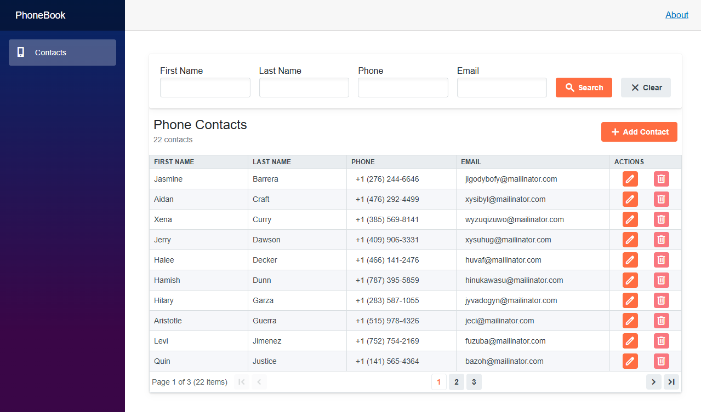

# PhoneBook

A simple phone contacts application built with an **ASP.NET ASMX web service** backend and a **Blazor Server** frontend.

The application supports:

- Viewing phone contacts
- Server-side pagination
- Server-side sorting
- Filtering by first name, last name, phone number, and email (list)
- Creating contacts
- Editing contacts
- Deleting contacts

## Application Preview



## Database Setup

The repository contains a SQL initialization script:

```text
database/PhoneBook.sql
```

Open `database/PhoneBook.sql` in SQL Server Management Studio and execute it.

The script will:

1. Create the `PhoneBook` database if it does not already exist.
2. Create the `PhoneContacts` table.
3. Insert sample contacts for testing.

## Database Connection

The ASMX backend uses `Web.config` for the SQL Server connection string.

For security reasons, the actual `Web.config` file is not included in the repository. A template is provided instead:

```text
src/PhoneBook.WebService/Web.config.template
```

Before running the application:

1. Copy `Web.config.template` to `Web.config`.
2. Open the new `Web.config` file.
3. Replace `YOUR_SQL_SERVER` with your SQL Server instance.
4. Save the file.

Example:

```xml
<connectionStrings>
  <add
    name="PhoneBookDb"
    connectionString="Data Source=YOUR_SQL_SERVER;Initial Catalog=PhoneBook;Integrated Security=True"
    providerName="System.Data.SqlClient" />
</connectionStrings>
```

For example, for a local SQL Server installation:

```xml
<connectionStrings>
  <add
    name="PhoneBookDb"
    connectionString="Data Source=localhost;Initial Catalog=PhoneBook;Integrated Security=True"
    providerName="System.Data.SqlClient" />
</connectionStrings>
```

The resulting file should be named:

```text
Web.config
```

and should be located in the ASMX backend project directory.

## Running the Application

### 1. Open the solution

Open the solution in Visual Studio.

### 2. Configure the database

Create the database and `PhoneContacts` table.

Configure the backend connection string.

### 3. Start the ASMX backend

Run the `PhoneBook` backend project.

The ASMX service should be available at its configured URL.

For example:

```text
http://localhost:<port>/PhoneBook.asmx
```

Open the `.asmx` URL in a browser to verify that the service is running.

### 4. Start the Blazor Server frontend

Run the `PhoneBook.Frontend` project.

For example, the application may start at:

```text
http://localhost:5004
```

Open the URL in your browser.

## Service Reference

The Blazor Server frontend already contains a configured service reference to the ASMX backend:

```text
PhoneBook.Frontend/
└── Connected Services/
    └── PhoneBook/
        ├── ConnectedService.json
        └── Reference.cs
```

The generated `Reference.cs` contains the client proxy and data contracts used by the frontend to communicate with the ASMX service.

If the ASMX service contract is changed, update the connected service in Visual Studio:

1. Open `PhoneBook.Frontend` in Visual Studio.
2. Expand **Connected Services**.
3. Right-click **PhoneBook**.
4. Select **Update**.
5. Rebuild the solution.

The service reference is configured to use the ASMX service endpoint defined in `ConnectedService.json`.

## Technology Stack

- C#
- .NET 7
- Blazor Server
- ASP.NET ASMX Web Services
- MS SQL Server
- ADO.NET
- Radzen.Blazor 7.4.3
- WCF / SvcUtil generated service reference
